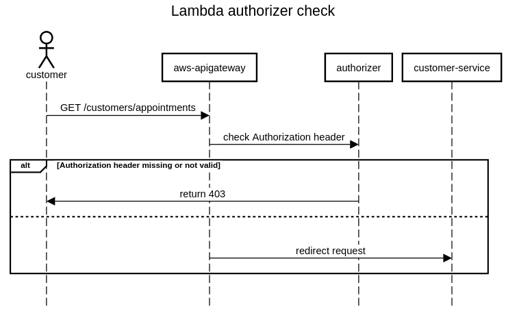

# Architecture overview

Securing APIs is a critical step in software architecture, and API keys are not sufficient for this purpose in most cases.

So in this project I've implemented an architecture on AWS where:

- every APIs are protected with an api-key
- you can protect an API with the access token generated after having verified the OTP (such as /auth/sign-up API, So you can prevent anyone from registering on your application without first proving their identity).
- you can protect an API with the access token generated by AWS Cognito after signing in (such as /customers/appointments APIs).


## Generate a temporary identity to sign up


## Sign in


# Auth



## Protect an API with the api key only

1. add `ApiKeyRequired` only and not `Authorizer`

```yml
ShopUserAvailability:
    Type: Api
    Properties:
    RestApiId: !Ref ApiGateway
    Path: /shops/{shopId}/employees/{employeeId}/availability
    Method: GET
    Auth:
        ApiKeyRequired: true
```

### Protect an API with the Lambda Authorizer and api key

1. add both `ApiKeyRequired` and `Authorizer`

```yml
ShopUserAvailability:
    Type: Api
    Properties:
    RestApiId: !Ref ApiGateway
    Path: /shops/{shopId}/employees/{employeeId}/availability
    Method: GET
    Auth:
        ApiKeyRequired: true
        Authorizer: LambdaTokenAuthorizer
```

2. update `api/authorizer/app.ts` adding that API inside the allowed resource arrays depending on customer role (or guest)

```javascript
const adminAllowedResources = [
  "arn:aws:execute-api:eu-central-1:*:*/dev/GET/admin/shop/appointments",
  "arn:aws:execute-api:eu-central-1:*:*/dev/POST/admin/shop/appointments",
  "arn:aws:execute-api:eu-central-1:*:*/dev/GET/admin/shop-details",
]

const guestAllowedResources = ["arn:aws:execute-api:eu-central-1:*:*/dev/POST/auth/sign-up"]

const customerAllowedResources = [
  "arn:aws:execute-api:eu-central-1:*:*/dev/GET/customers/appointments",
  "arn:aws:execute-api:eu-central-1:*:*/dev/POST/customers/appointments",
]
```

# Deploy

create an S3 bucket in your account and set its name to s3_bucket key of samconfig.toml file

- setup api/.secrets/dev folder containing the secrets created in api/template.yml
- then to deploy in dev env, run the following command

```bash
./deploy.sh
```

now you can create a user on cognito using the script inside ```api/scripts``` folder or invoking the POST /auth/user account API

# Postman collection

postman_collection.json contains all the API in this project